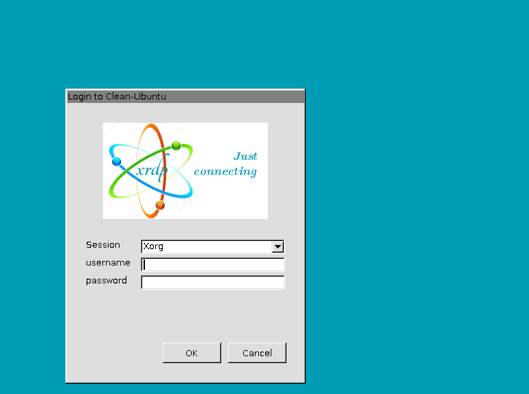

# Ubuntu_20.04-RDP-Access-Set-UP
### Summary 
This instruction shows you how to install and configure remote desktop protocol on Ubuntu 20.04 Desktop. 
### Outcome
The outcome of this guide is that you will be able to RDP to Ubuntu from a windows computer. 

# Software Requirements and Conventions Used
## Category	Requirements, Conventions or Software Version Used
#### System	Installed:  Ubuntu 20.04 or upgraded Ubuntu 20.04 Focal Fossa
#### Conventions	# - requires given linux commands to be executed with root privileges either directly as a root user or by use of sudo command
#### $ - requires given linux commands to be executed as a regular non-privileged user

# Ubuntu 20.04 Remote Desktop Access from Windows 10 step by step instructions
## Step 1
First step is to install Remote Desktop Protocol (RDP) server xrdp on the Ubuntu 20.04 desktop. To do so execute the following command:
> sudo apt install xrdp
## Step 2
Enable to start after reboot and run the remote desktop sharing server xrdp:
> sudo systemctl enable --now xrdp
## Step 3
Still on the Ubuntu 20.04 desktop, open a firewall port 3389 for an incoming traffic:
> sudo ufw allow from any to any port 3389 proto tcp
## Step 4
Log out of the ubuntu computer you want to connect to 
## Step 5
Press the winodws button on your windows computer and type rdp
> click on rdp and enter the remote computer's IP address like below 

## Step 5
#### Enter the username and password for the remote server
Press enter after entering the username and password of the remote ubuntu computer 

